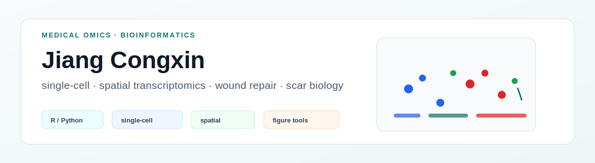

<p align="center">
  
</p>

# Jiang Congxin

Medical omics and bioinformatics analyst working across plastic surgery, wound repair, scar biology, public datasets, and reproducible research workflows.

I focus on turning clinical questions into traceable analysis pipelines, interpretable biological results, and clean figures for manuscripts and collaboration.

## Current Focus

- Single-cell RNA-seq and spatial transcriptomics for wound repair and scar biology
- Public database mining for clinically relevant hypotheses
- Multi-omics integration and pathway-level interpretation
- R / Python workflows for reproducible analysis and figure generation
- Medical AI and clinical decision-support literature tracking
- AI-assisted scientific writing with evidence control and citation discipline

## Tools and Projects

| Project | Type | What it is for |
|---|---|---|
| [ncfigR](https://github.com/jiangcongxin/ncfigR) | R package | Drawing common bioinformatics figure panels from tidy source-data tables. |
| [NC Bioinformatics Figure Skills](https://github.com/jiangcongxin/nc-bioinformatics-figure-skills) | Codex skill | Learning figure design from reproducible omics papers. |

## Analysis Stack

<p>
  
  
  
  
  
  
  
  
</p>

```text
R / Python
Seurat / Scanpy
ggplot2 / ComplexHeatmap / patchwork
single-cell RNA-seq / spatial transcriptomics
public database mining / clinical research analytics
reproducible figures / manuscript-ready outputs
```

## Research Directions

- Plastic surgery and wound repair
- Scar and keloid biology
- Single-cell and multi-omics analysis
- Public database mining
- Medical AI and clinical decision support
- AI-assisted scientific writing

## GitHub Activity

<p>
  
  
</p>

## Contact

- Email: [jcx981212@163.com](mailto:jcx981212@163.com)
