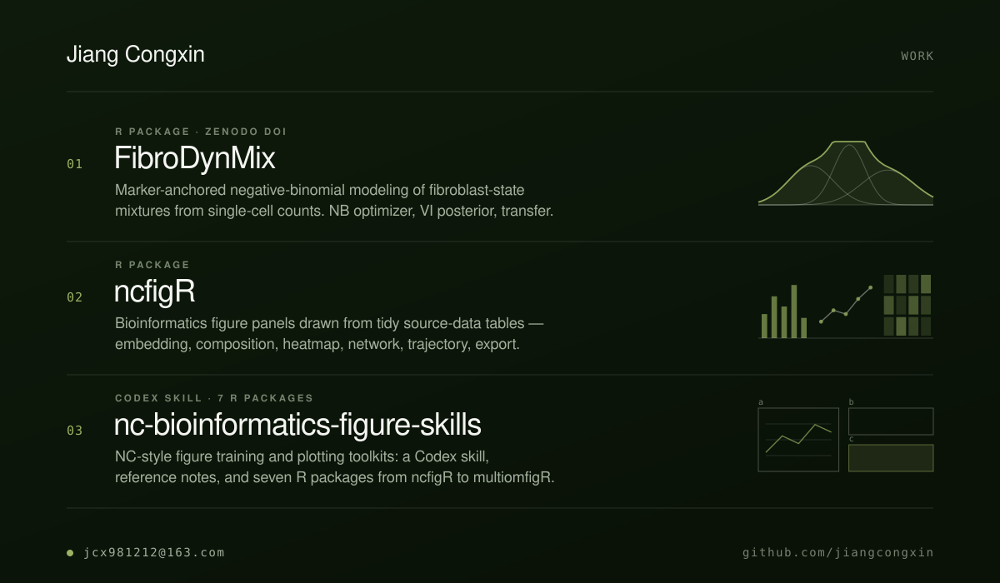

  <picture>
    <source media="(prefers-color-scheme: dark)" srcset="assets/canvas-dark.svg">
    <source media="(prefers-color-scheme: light)" srcset="assets/canvas-light.svg">
    
  </picture>

  <a href="https://github.com/jiangcongxin/FibroDynMix">FibroDynMix</a> &nbsp;·&nbsp;
  <a href="https://github.com/jiangcongxin/ncfigR">ncfigR</a> &nbsp;·&nbsp;
  <a href="https://github.com/jiangcongxin/nc-bioinformatics-figure-skills">nc-bioinformatics-figure-skills</a> &nbsp;·&nbsp;
  <a href="https://doi.org/10.5281/zenodo.20787527">DOI</a> &nbsp;·&nbsp;
  <a href="mailto:jcx981212@163.com">Email</a>

