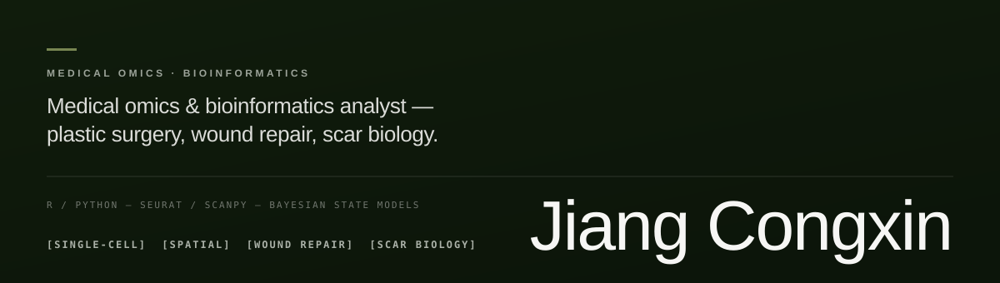

  

## About

Medical omics and bioinformatics analyst working across **plastic surgery, wound repair, and scar biology**. I turn clinical questions into traceable analysis pipelines, interpretable biological results, and manuscript-ready figures.

## 01 — Research Focus

- **Single-cell & spatial omics** — scRNA-seq and spatial transcriptomics for wound repair and scar biology
- **Statistical modeling** — hierarchical Bayesian dynamic mixture models of fibroblast state plasticity
- **Public data mining** — clinically relevant hypotheses from public cohorts and atlases
- **Reproducible figures** — NC-style, source-data-driven figure tooling
- **Medical AI** — clinical decision support and evidence-controlled scientific writing

## 02 — Featured Projects

| Project | Type | What it is for |
|---|---|---|
| [FibroDynMix](https://github.com/jiangcongxin/FibroDynMix) | R package · [DOI](https://doi.org/10.5281/zenodo.20787527) | Hierarchical Bayesian dynamic mixture model of fibroblast state plasticity — simulator, NB optimizer, VI posterior, and cross-cohort transfer. |
| [ncfigR](https://github.com/jiangcongxin/ncfigR) | R package | NC-style bioinformatics figure toolkit: common figure panels from tidy source-data tables. |
| [nc-bioinformatics-figure-skills](https://github.com/jiangcongxin/nc-bioinformatics-figure-skills) | Codex skill | Figure design distilled from reproducible omics papers. |

## 03 — Analysis Stack

`R` · `Python` · `Seurat` · `Scanpy` · `ggplot2` · `ComplexHeatmap` · `Bayesian modeling` · `Spatial omics`

## 04 — GitHub Stats

  
  

## Contact

- Email: [jcx981212@163.com](mailto:jcx981212@163.com)
