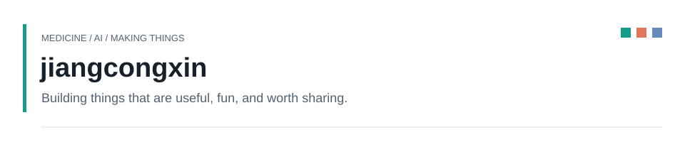

<picture>
  <source media="(prefers-color-scheme: dark)" srcset="assets/research-header-dark.svg">
  <source media="(prefers-color-scheme: light)" srcset="assets/research-header-light.svg">
  
</picture>

I'm **jiangcongxin**. Medicine is my starting point; AI opens up what I can build.

I use **Codex and Claude** to explore ideas, write code, and make tools for medicine, research, and everyday life.

**Building things that are useful, fun, and worth sharing.**

### Medical software

| Project | Purpose | Explore |
| :--- | :--- | :--- |
| **ClinFrame · 文书助手** | Helps physicians organize clinical information and prepare medical documents. | [Product website](https://clinframe.com/) |
| **ClinSift · 临析** | Brings clinical research data management, statistical analysis, and publication-ready charts and tables to iPhone. | [Public support pages](https://github.com/jiangcongxin/ClinSift-Support) |

### Research tools

| Project | Purpose | Explore |
| :--- | :--- | :--- |
| **[FibroDynMix](https://github.com/jiangcongxin/FibroDynMix)** | An R package for modeling fibroblast-state mixtures from single-cell count data. | [Function index](https://github.com/jiangcongxin/FibroDynMix/blob/main/docs/package-function-index.md) · [Releases](https://github.com/jiangcongxin/FibroDynMix/releases) |
| **[ncfigR](https://github.com/jiangcongxin/ncfigR)** | Draws consistent bioinformatics figure panels from tidy analysis tables. | [Install and example](https://github.com/jiangcongxin/ncfigR#installation) |
| **[NC Bioinformatics Figure Skills](https://github.com/jiangcongxin/nc-bioinformatics-figure-skills)** | A Codex skill and R toolkit collection for planning and creating bioinformatics figures. | [Package map](https://github.com/jiangcongxin/nc-bioinformatics-figure-skills#r-package-map) |

### What I like building

Medical tools · Research software · Data visualizations · Small experiments with AI

**Made with** &nbsp; Codex · Claude · SwiftUI · R · Python

---

Have an idea to build together? **[jcx981212@163.com](mailto:jcx981212@163.com)**

[GitHub projects](https://github.com/jiangcongxin?tab=repositories) · [FibroDynMix archive](https://doi.org/10.5281/zenodo.20787527)
